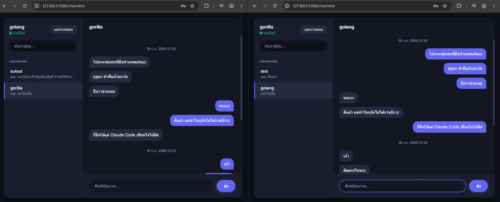

# go-web-socket


### โปรเจกต์เรียนรู้การทำ **ระบบแชทส่วนตัว (direct message) แบบเรียลไทม์** ด้วย WebSocket — เขียนด้วย Go + gorilla/websocket + JWT + GORM + PostgreSQL จัดโครงสร้างแบบ hexagonal architecture และพิสูจน์ความถูกต้องด้วย race detector บน CI

## WebSocket คืออะไร ?

HTTP ปกติทำงานแบบ **"ถาม-ตอบแล้วจบ"**
- client ส่ง request → server ตอบ response → ตัดการเชื่อมต่อ
- แปลว่า **server เริ่มส่งข้อมูลหาเราเองไม่ได้** — ถ้ามีข้อความแชทใหม่เข้ามา client ต้องคอยถามซ้ำๆ เรื่อยๆ (polling) ซึ่งทั้งช้าและเปลืองทรัพยากร

**WebSocket** แก้ปัญหานี้โดยเริ่มจาก HTTP request ธรรมดา แล้วขอ **"upgrade"** การเชื่อมต่อให้กลายเป็น **ท่อถาวรที่คุยได้สองทาง**
- เปิดค้างไว้ตลอด ไม่ต้องสร้าง connection ใหม่ทุกครั้ง
- ทั้ง client และ server ส่งข้อความหากันได้ทันทีเมื่อไหร่ก็ได้
- เหมาะกับงานเรียลไทม์ เช่น แชท, แจ้งเตือน

## ระบบแชทในโปรเจกต์นี้ทำอะไรได้

- สมัครสมาชิก / เข้าสู่ระบบ (เก็บรหัสผ่านแบบ bcrypt, ออก JWT อายุ 24 ชม.)
- ส่งข้อความส่วนตัวผ่าน WebSocket — ถึง**ทุกแท็บ**ที่ผู้รับเปิดอยู่ และ**บันทึกลงฐานข้อมูลแม้ผู้รับออฟไลน์** (กลับมา login ก็เห็นย้อนหลัง)
- ค้นหาผู้ใช้, ดูประวัติแชทรายคน, ดูรายการบทสนทนาล่าสุด (REST + Bearer token)



## จัดการ race condition ยังไง ?

state ของ connection ทั้งหมด (map ของ client ที่ออนไลน์อยู่) ถูกดูแลโดย **goroutine เดียว** ชื่อ `AcceptLoop` — การ join / leave / ส่งข้อความ ทุกอย่างไหลเข้ามาทาง **channel** แล้วให้ goroutine นี้จัดการทีละเรื่อง จึงไม่มีสอง goroutine แตะ map พร้อมกัน

ทดสอบด้วยการรันคำสั่ง `make test-chat-race`

## โครงสร้างโปรเจกต์

```
├── main.go                     # composition root: ประกอบ dependency + routes
├── main_test.go                # เทส DM / concurrent ring / churn (ผ่าน -race)
├── chat.html                   # หน้าเว็บแชท (เปิดได้เลย ไม่ต้องมี web server)
├── Makefile                    # คำสั่งลัด (chat / db-* / test-*)
├── docker-compose.yml          # PostgreSQL 16 (พอร์ต 5433)
├── .env.example                # ตัวอย่าง config (copy เป็น .env ถ้าอยากแก้ค่า)
├── .github/workflows/test.yml  # CI: รัน make test-chat-race
├── config/
│   └── config.go               # โหลด config จาก .env / environment variables
├── handlers/                   # adapter ขาเข้า: REST + WebSocket client session
├── services/                   # business logic: auth (bcrypt/JWT), chat
└── repositories/               # data access: gorm (PostgreSQL) + in-memory mock
```

## คำสั่งลัด

| คำสั่ง | ทำอะไร |
|---|---|
| `make db-up` | เปิด PostgreSQL (docker, พอร์ต 5433) |
| `make chat` | รัน `go mod tidy` แล้ว start server ที่พอร์ต 3223 |
| `make test-chat` | รันเทสทั้งชุดด้วย mock — ไม่ต้องเปิด docker/DB |
| `make test-chat-race` | ชุดเดียวกัน ภายใต้ Go race detector |
| `make db-users` | ดูรายชื่อ user ในฐานข้อมูล |
| `make db-messages` | ดูข้อความล่าสุด 20 รายการ |
| `make db-shell` | เข้า psql shell ในคอนเทนเนอร์ |
| `make db-down` | ปิด PostgreSQL (ข้อมูลยังอยู่) |
| `make db-reset` | ปิด PostgreSQL และ**ลบข้อมูลทั้งหมด** |

## ลองแชทดู

สิ่งที่ต้องมี: [Go](https://go.dev/dl/) 1.25+, [Docker](https://www.docker.com/products/docker-desktop/) และ `make` (Windows ใช้ผ่าน Git Bash)

### 1. Clone แล้วเปิดฐานข้อมูล

```bash
git clone https://github.com/aprbq/go-web-socket.git
cd go-web-socket
make db-up    # ต้องเปิด Docker ไว้ก่อน — รอบแรกรอสัก 5 วินาทีให้ PostgreSQL พร้อม
```

### 2. เปิดเซิร์ฟเวอร์ (อีก terminal นึง แล้วค้างไว้)

```bash
make chat     # เห็น "starting server on port: :3223" แปลว่าพร้อม
```

### 3. เปิดหน้าแชทแล้วคุยกัน 2 คน

1. เปิดไฟล์ `chat.html` ในเบราว์เซอร์ **2 หน้าต่าง** (ดับเบิลคลิกไฟล์ได้เลย ไม่ต้องมี web server)
2. สมัครสมาชิกคนละ user แล้วเข้าสู่ระบบทั้งสองหน้าต่าง
3. พิมพ์ชื่ออีกฝ่ายในช่องค้นหา → คลิกชื่อ → เริ่มพิมพ์แชทได้เลย
4. ลองปิดหน้าต่างฝั่งผู้รับแล้วส่งข้อความไป — พอเขา login กลับมา ข้อความยังอยู่ครบ

เลิกใช้งาน: กด `Ctrl+C` หยุด server แล้ว `make db-down` (ข้อมูลไม่หาย รอบหน้า `make db-up` กลับมาได้เลย)

## APIs ของระบบ

| Method | Path | ใช้ทำอะไร |
|---|---|---|
| POST | `/register` | สมัครสมาชิก `{"username","password"}` |
| POST | `/login` | เข้าสู่ระบบ → ได้ JWT token กลับไป |
| GET | `/users?q=...` | ค้นหาผู้ใช้ (ไม่รวมตัวเอง) |
| GET | `/dm/history?peer=...` | ประวัติแชทกับคนนั้น (เห็นเฉพาะแชทของตัวเอง) |
| GET | `/dm/conversations` | รายการบทสนทนาล่าสุด |
| WS | `/ws?token=...` | เชื่อมต่อแชทเรียลไทม์ |
